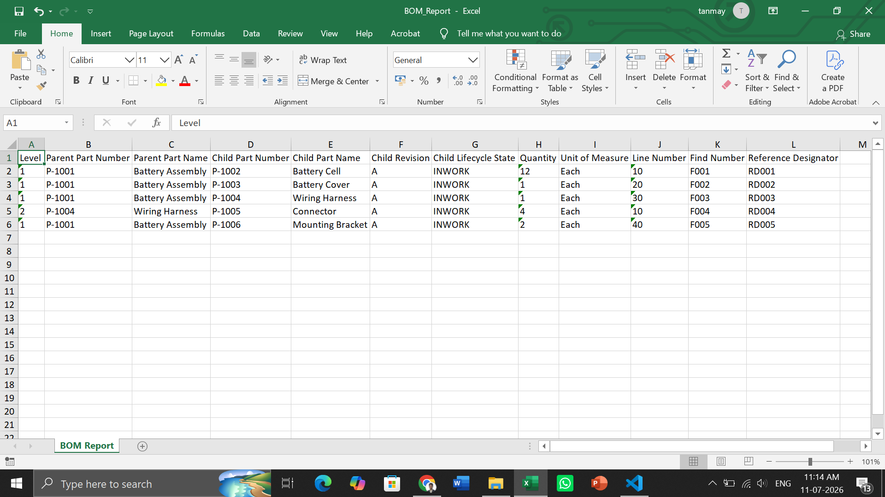
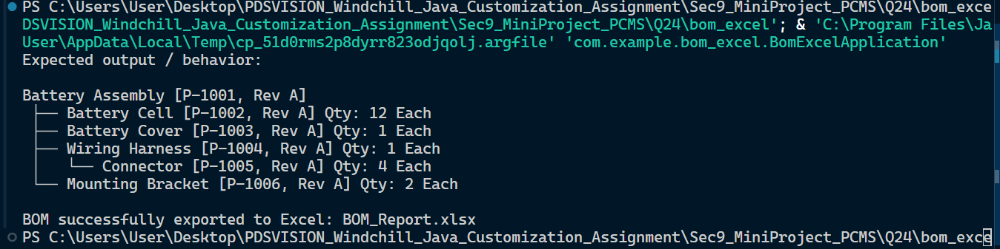

# Section 10: Mini Project - BOM Structure, Excel Export, Import, and Update

# Question 24: Create Part, Child Parts, BOM Usage Links, and Export BOM Report to Excel

Create a Java application that allows the creation of parts, child parts, usage links between parts, and exports a Bill of Materials (BOM) report to Excel.

- Create a `Part` class with part number, part name, revision, lifecycle state, part type, created by, and created date.
- Create a `PartUsageLink` class with parent part, child part, quantity, unit of measure, line number, find number, and reference designator.
- Create at least one parent assembly, four child parts, and one sub-child under any child part.
- Print the BOM structure in the console with indentation.
- Export the BOM structure to Excel using Apache POI or another Java Excel library.

## File Structure

```text
project-root/
├── pom.xml
├── src/
│   ├── main/
│   │   ├── java/
│   │   │   └── com/
│   │   │       └── example/
│   │   │           └── bom_excel/
│   │   │               ├── BomExcelApplication.java
│   │   │               │
│   │   │               ├── model/
│   │   │               │   ├── Part.java
│   │   │               │   └── PartUsageLink.java
│   │   │               │
│   │   │               ├── service/
│   │   │               │   └── BOMService.java
│   │   │               │
│   │   │               └── runner/
│   │   │                   └── DataLoader.java

```

## Screenshots

Excel Report

Program output


## Run Command

Assuming you are using Maven to handle the required Apache POI dependencies for the Excel export:

**1. Compile the project:**

```bash
mvn clean install

```

**2. Run the application:**

```bash
mvn spring-boot:run

```
