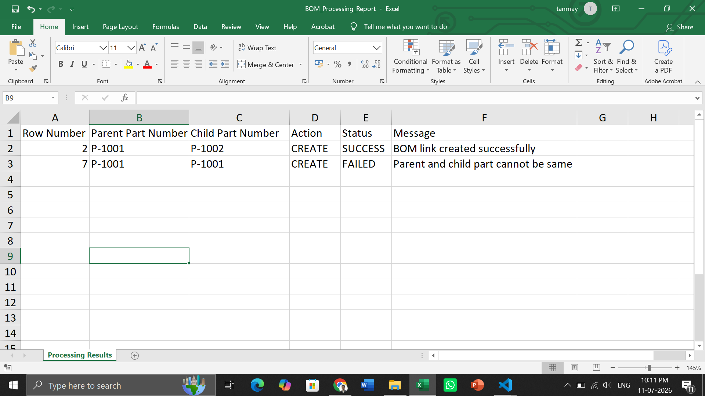

# Section 10: Mini Project - BOM Structure, Excel Export, Import, and Update

# Question 25: Use Same Excel Format to Create or Update BOM

- Enhance the BOM assignment so that the same Excel report format can also be used as an input template for BOM
creation or BOM update.
- Add one extra Excel column called Action.
- Allowed Action values: CREATE, UPDATE, DELETE.
- Read Excel rows into BOMImportRow objects.
- Validate all rows before processing.
- Create a new BOM if the parent BOM does not exist.
- Update an existing BOM if the parent BOM already exists.
- Generate a row-wise processing result report

```text
src/main/java
└── com.assignment.bom
 ├── model
 │ ├── Part.java
 │ ├── PartUsageLink.java
 │ ├── BOMImportRow.java
 │ └── BOMProcessingResult.java
 ├── service
 │ ├── BOMService.java
 │ ├── ExcelExportService.java
 │ ├── ExcelImportService.java
 │ ├── BOMValidationService.java
 │ ├── BOMUpdateService.java
 │ └── BOMResultExportService.java
 └── Main.java
```

# Screenshots
