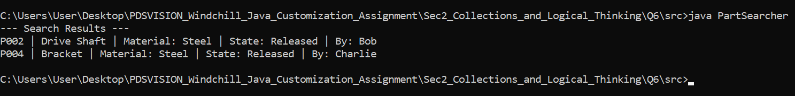

## Section 2: Collections and Logical Thinking

## Question 6: Part Attribute Searcher

This repository contains a Java solution to define a complex `Part` object and search through a list of those objects based on specific attributes (Material and Lifecycle State).

## 🛠 How It Works

1. **`Part` Class:** A data model representing a part with attributes: `partNumber`, `name`, `material`, `state`, and `createdBy`.
2. **Search Methods:** \* **`searchParts()`**: Uses a traditional `for` loop to iterate through the list and conditionally add matching elements to a new result list.
   - **`searchPartsStream()`**: Uses the modern Java Stream API (`.stream().filter().collect()`) to achieve the exact same logic functionally. Both methods utilize `.equalsIgnoreCase()` to prevent case-sensitivity bugs.

## Project Structure

```text
src/
├── PartSearcher.java
```

## Screenshots



## 🚀 Prerequisites

- **Java Development Kit (JDK):** Version 8 or higher is required (specifically for the Stream API implementation).

## 💻 How to Run

1. Open your terminal or command prompt.
2. Navigate to the directory containing the `.java` file.
3. Compile the Java file using `javac`:
   ```bash
   javac PartSearcher.java
   java PartSearcher
   ```
