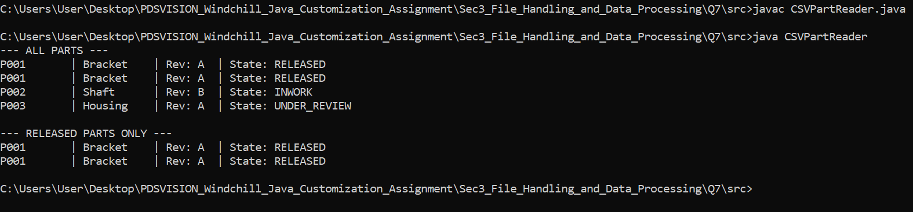

## Section 3: File Handling and Data Processing

## Question 7: CSV Part Data Reader

This project demonstrates how to read a CSV file in Java, parse the data into custom Plain Old Java Objects (POJOs), and filter the list based on specific properties.

## 🛠 Features

1. **File I/O:** Uses `BufferedReader` and `FileReader` to safely and efficiently stream lines from a CSV file.
2. **Data Parsing:** Splits CSV rows into an array of strings and converts them into `Part` objects, while safely ignoring the header row.
3. **Stream Filtering:** Utilizes the Java 8 Stream API (`.stream().filter()`) to isolate parts that have a state of `"RELEASED"`.

## Project Structure

```text
src/
├── CSVPartReader.java
├── parts.csv
└── Main.java
```

## Screenshots



## 🚀 Prerequisites

- **Java Development Kit (JDK):** Version 8 or higher.
- The `parts.csv` file must be located in the same directory where you run the program.

## 💻 How to Run

1. Open your terminal or command prompt.
2. Ensure both `CSVPartReader.java` and `parts.csv` are in the same folder.
3. Compile the Java file using `javac`:
   ```bash
   javac CSVPartReader.java
   java CSVPartReader
   ```
