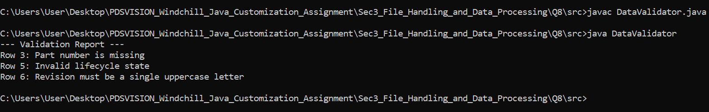

# Import Data Validator

This project provides a Java utility to validate part data imported from CSV or Excel files. It processes the data row by row and outputs specific error messages for any data that violates the business rules.

## 🛡️ Validation Rules

The validation engine enforces the following constraints:

1. **Part Number:** Cannot be blank or empty.
2. **Part Name:** Cannot be blank or empty.
3. **Revision:** Must be exactly one uppercase alphabetical character (A-Z).
4. **Lifecycle State:** Must exactly match one of the approved states: `INWORK`, `UNDER_REVIEW`, `RELEASED`, or `OBSOLETE`.

## 🛠️ Technical Details

- **Regular Expressions:** The revision column is validated using the regex `^[A-Z]$` to guarantee strict compliance.
- **HashSets:** The valid states are stored in a `HashSet` to provide highly efficient, constant-time `O(1)` lookups.
- **Robust Splitting:** The CSV parser uses `String.split(",", -1)` to ensure that if a row ends with empty commas, those empty values are still captured and flagged appropriately rather than throwing an `ArrayIndexOutOfBoundsException`.

## Screenshots



## 🚀 How to Run

1. Open your terminal or command prompt.
2. Navigate to the directory containing the `.java` file.
3. Compile the Java file using `javac`:
   ```bash
   javac DataValidator.java
   java DataValidator
   ```
