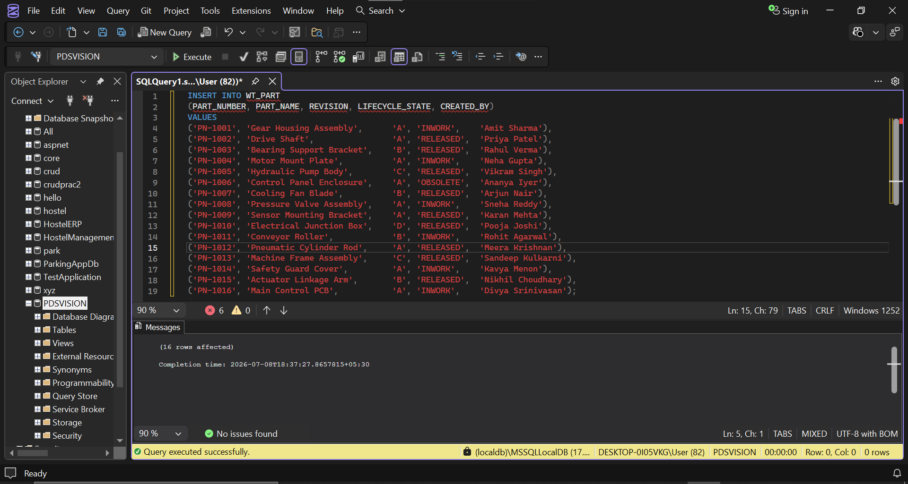
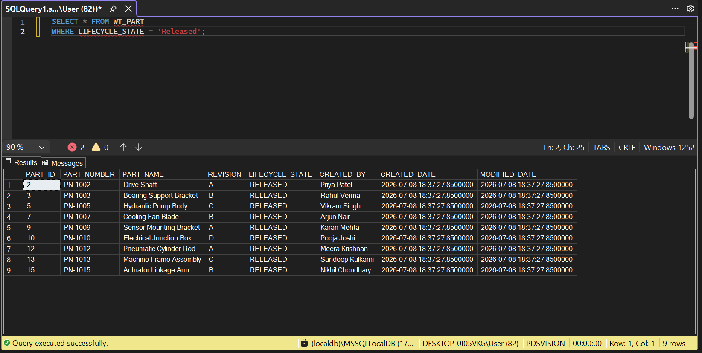
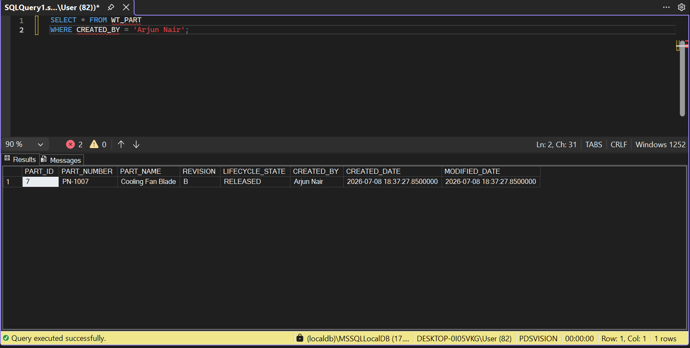
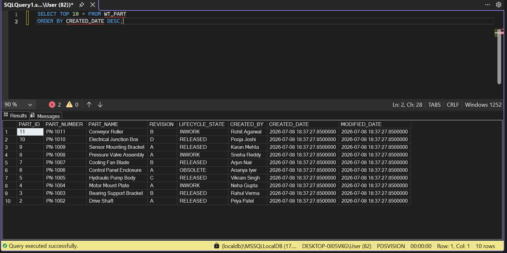
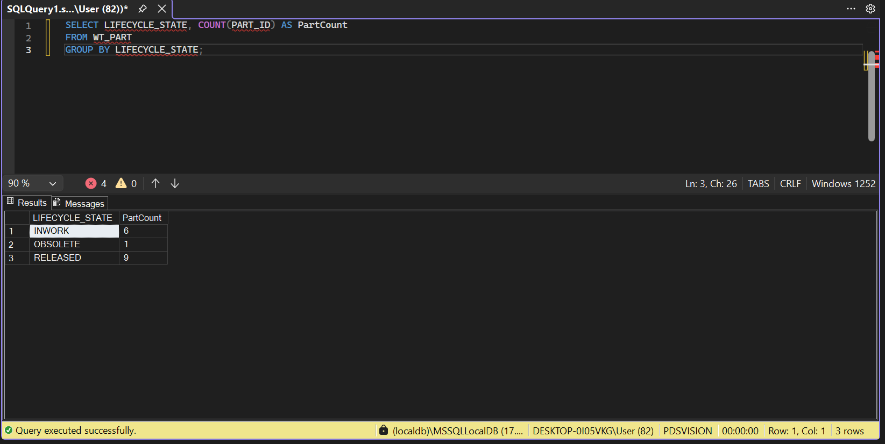

## Section 4: SQL and Database Understanding

## Question 10: SQL Query for released Parts

# Screenshot: Inserting Data

# Screenshot: Released state find

# Screenshot: Search by name

# Screenshot: Top 10 rows

# Screenshot: Group by state

