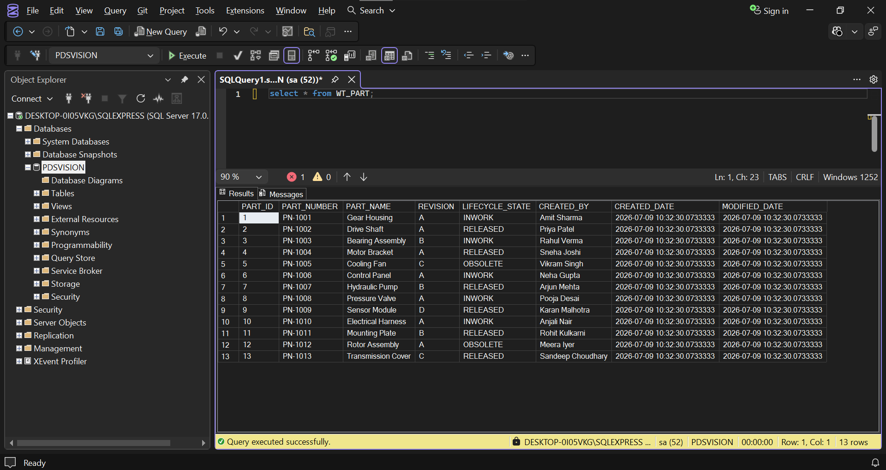
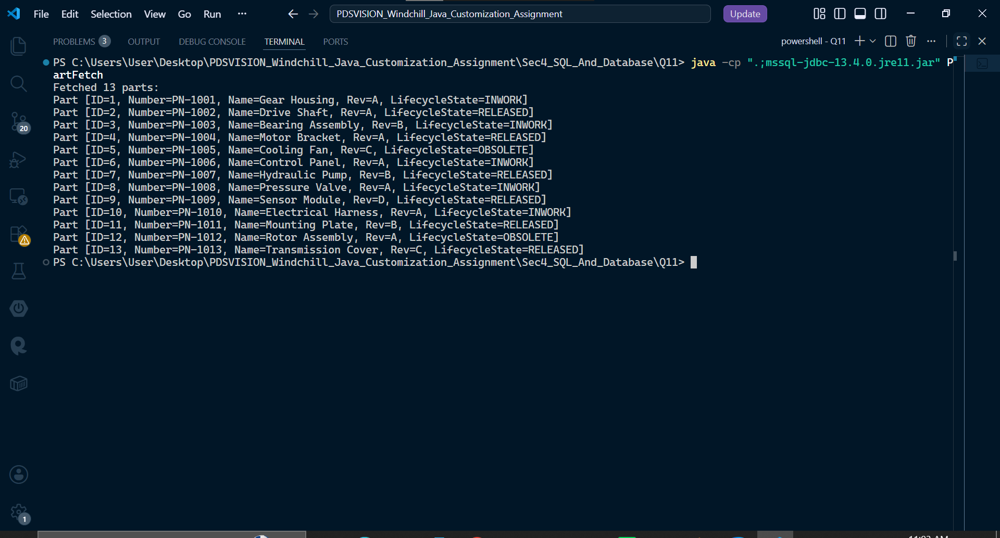

## Section 4: SQL and Database

## Question 11: Java JDBC Assignment

Write a Java JDBC program to connect to an MS SQL Server database and fetch all parts from the `WT_PART` table. Map `ResultSet` rows to Java objects and print the result.

## Folder Structure

```text
Q11/
│
├── mssql-jdbc-13.4.0.jre11.jar
│
└── src/
    ├── Part.java
    └── PartFetch.java
```

## Compile Command

```bash
javac -cp ".;mssql-jdbc-13.4.0.jre11.jar" -d . src\Part.java src\PartFetch.java
```

## Run Command

```bash
java -cp ".;mssql-jdbc-13.4.0.jre11.jar" PartFetch
```

## Screenshots

### Database Table



### Program Execution


