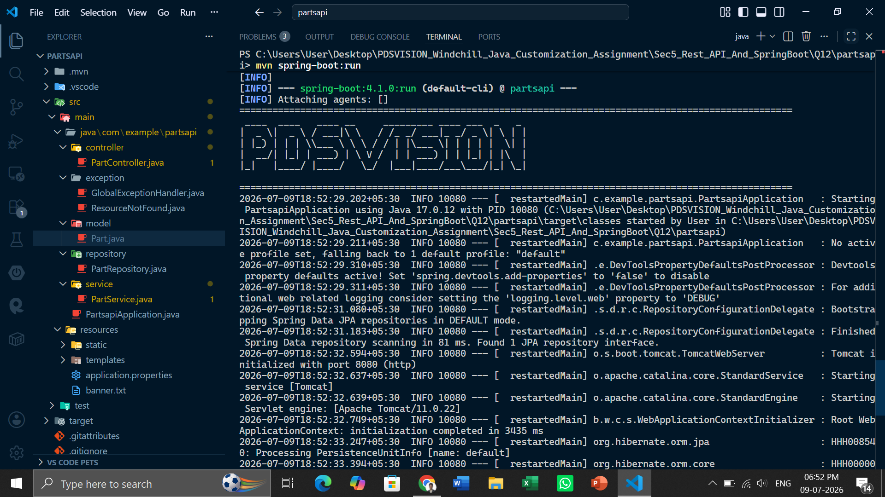
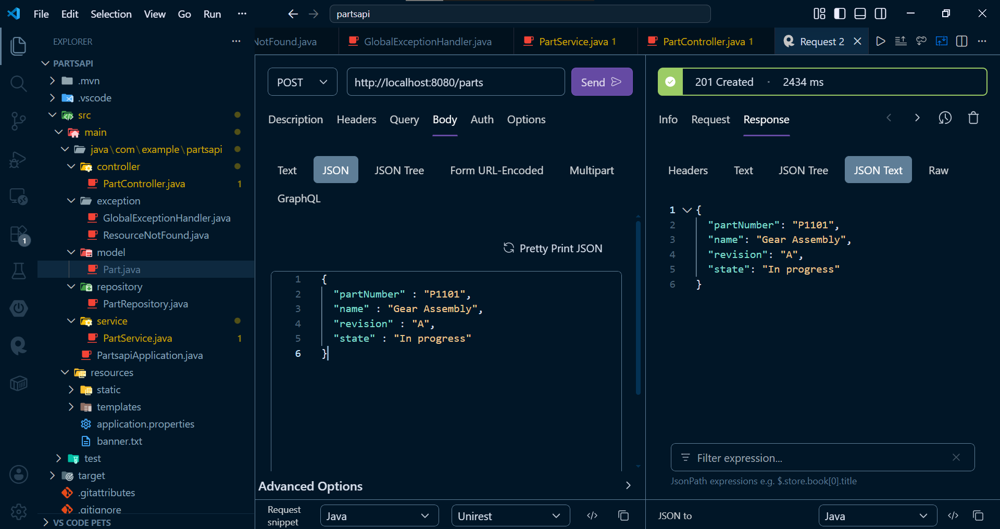
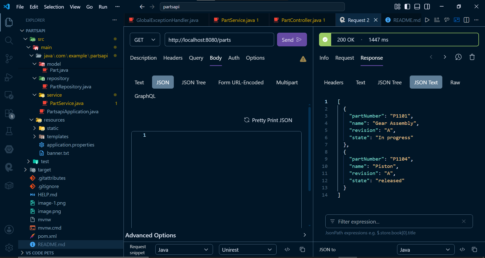
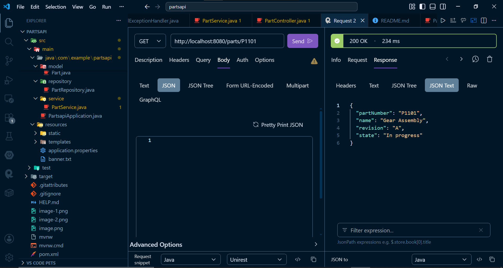
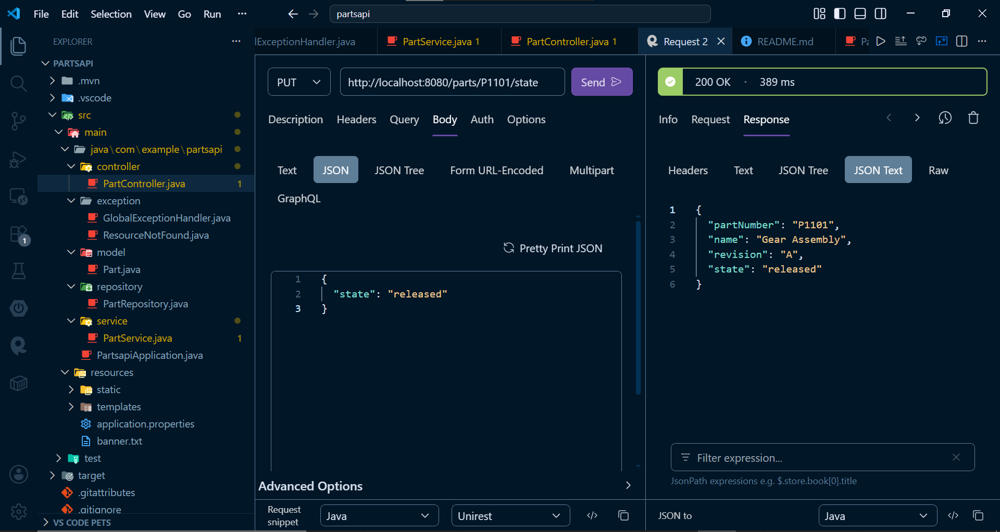
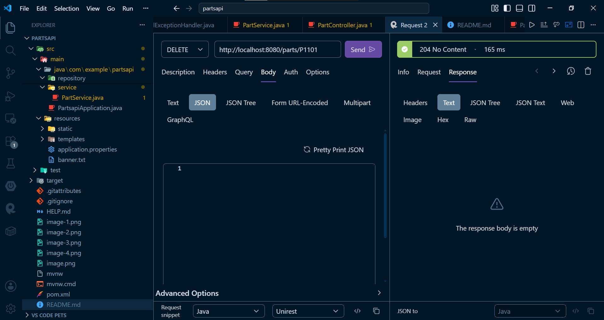

# Section 5: REST API and Spring Boot

## Question 12: Create a REST API for Parts

• Using Spring Boot, create REST APIs for managing parts.
• Use in-memory storage using Map if database is not implemented.
• The Part object should have part number, name, revision, and state.
GET /parts
GET /parts/{partNumber}
POST /parts
PUT /parts/{partNumber}/state
DELETE /parts/{partNumber}

## Overview

This project is a Spring Boot application providing a RESTful API to manage industrial parts. It exposes standard HTTP endpoints to perform CRUD operations (Create, Read, Update, Delete) on Part objects, managing specific attributes like part number, name, revision, and state.

## File Structure

```text
partsapi/
├── pom.xml
└── src/
    └── main/
        ├── java/
        │   └── com/example/partsapi/
        │       ├── PartsapiApplication.java
        │       ├── controller/
        │       │   └── PartController.java
        │       ├── exception/
        │       │   ├── GlobalExceptionHandler.java
        │       │   └── ResourceNotFoundException.java
        │       ├── model/
        │       │   └── Part.java
        │       ├── repository/
        │       │   └── PartRepository.java
        │       └── service/
        │           └── PartService.java
        └── resources/
            └── application.properties

```

## Screenshots

**Program Running successfully**


**POST /parts - Create a new part**


**GET /parts - Retrieve all parts**


**GET /parts/{partNumber} - Retrieve a part by its number**


**PUT /parts/{partNumber}/state - Update part state**


**DELETE /parts/{partNumber} - Delete a part**


## Run Command

```bash
mvn spring-boot:run

```
