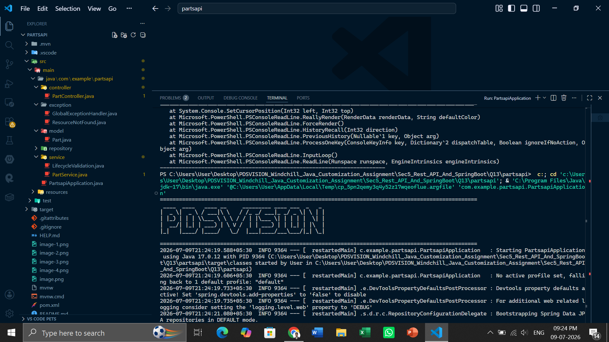
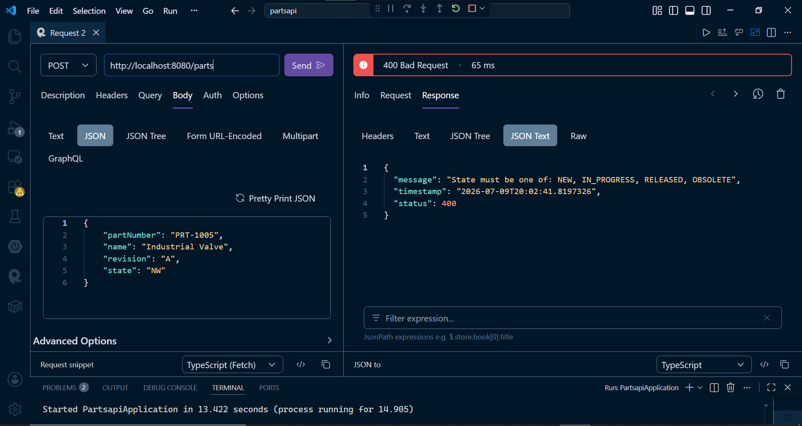
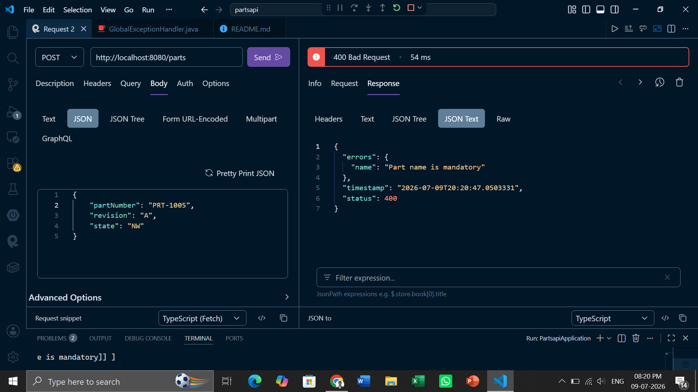
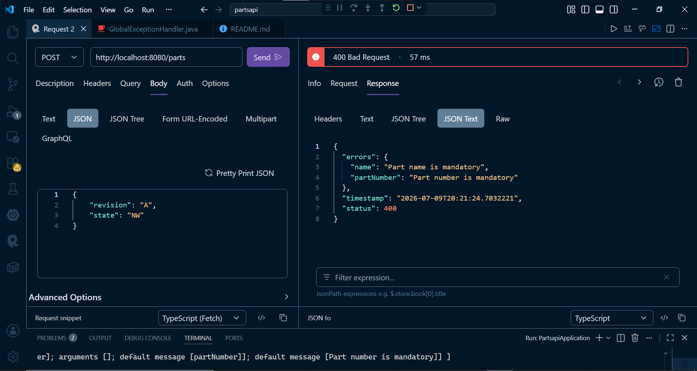
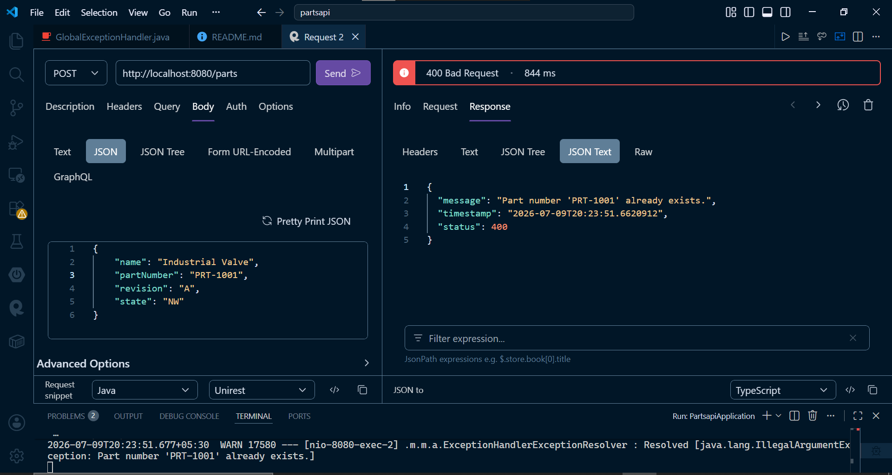
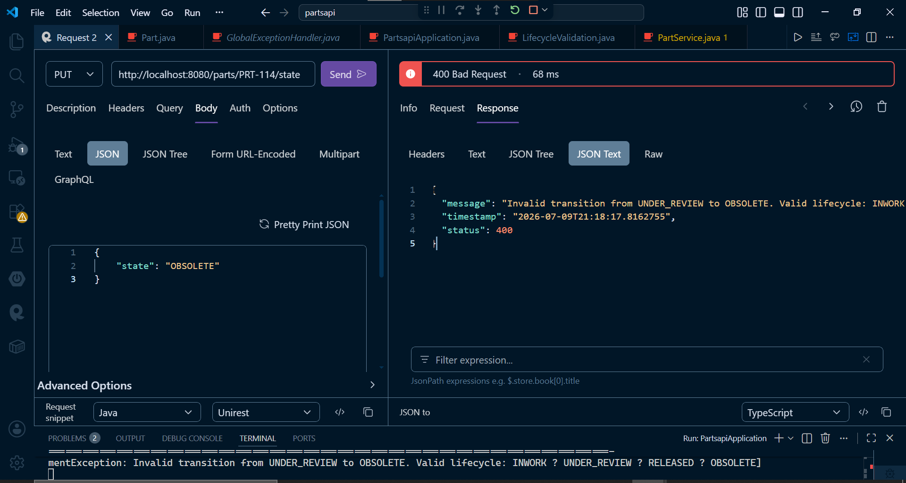
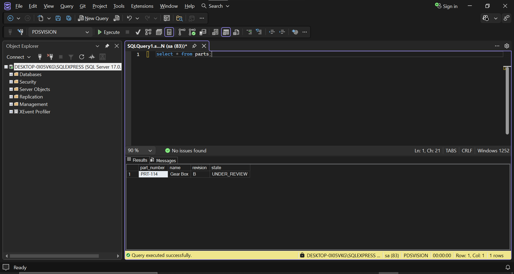
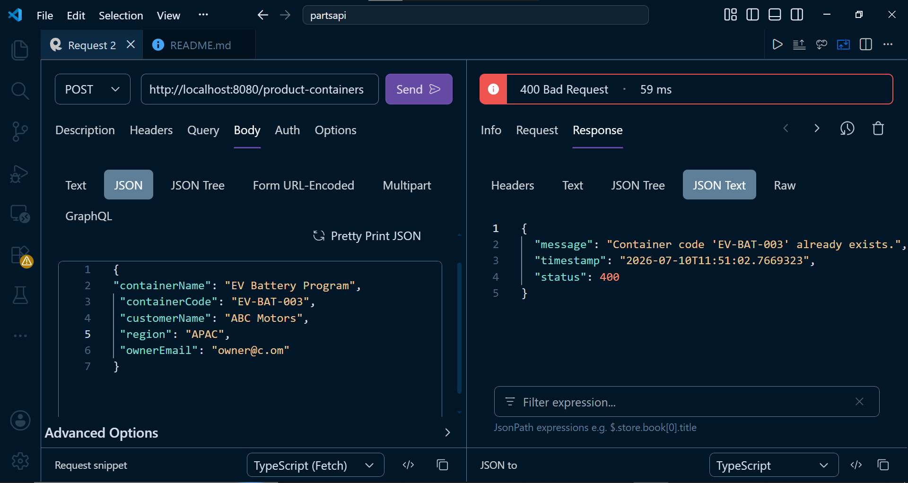
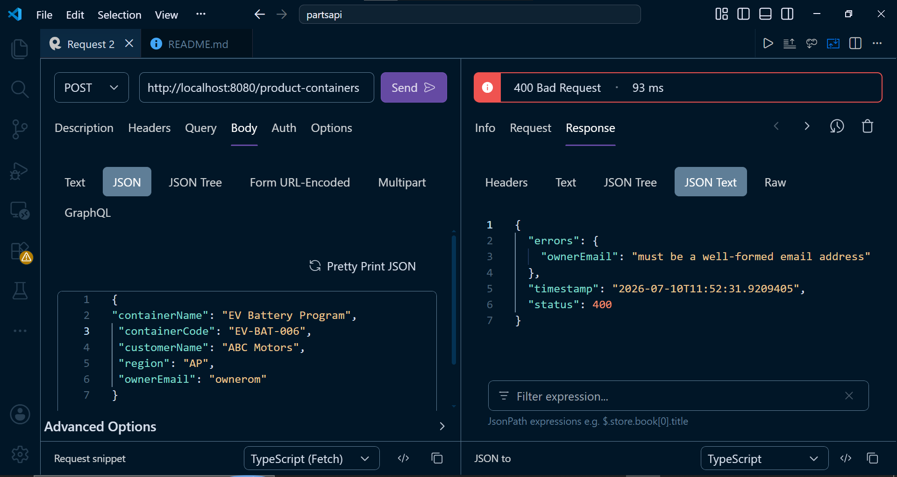

# Section 5: REST API and Spring Boot

## Question 13: REST API Validation

• Enhance the Part API with validation.
• Part number and part name are mandatory.
• State should be valid.
• Duplicate part numbers should not be allowed.
• Return meaningful error messages.

## File Structure

```text
partsapi/
├── pom.xml
└── src/
    └── main/
        ├── java/
        │   └── com/example/partsapi/
        │       ├── PartsapiApplication.java
        │       ├── controller/
        │       │   └── PartController.java
        │       ├── exception/
        │       │   ├── GlobalExceptionHandler.java
        │       │   └── ResourceNotFoundException.java
        │       ├── model/
        │       │   └── Part.java
        │       ├── repository/
        │       │   └── PartRepository.java
        │       └── service/
        │           └── PartService.java
        │           └── LifeCycleValidation.java
        └── resources/
            └── application.properties

```

## Screenshots

**Program Run Successfully**


**POST /parts - Invalid State**


**POST /parts - Part name Required**

**POST /parts/{partNumber} - Part name and number required**


**POST /parts/ - part number already exixsts**


**PUT /parts/{partNumber}/state - Invalid life cycle**


**Database screenshot**


**Container Created**


**Duplicate Container**


**Region Validation**


**Valid email format**


## Run Command

```bash
mvn spring-boot:run
```
