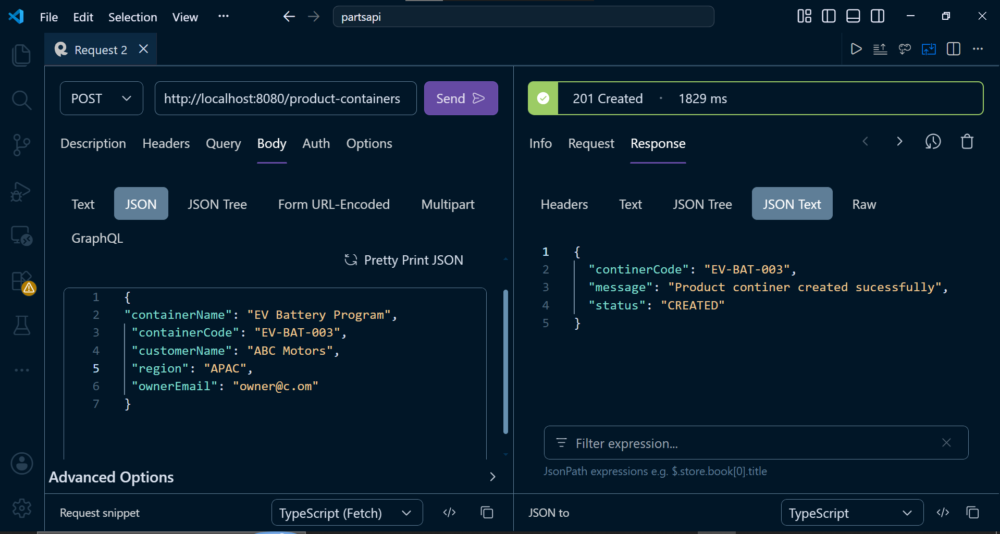
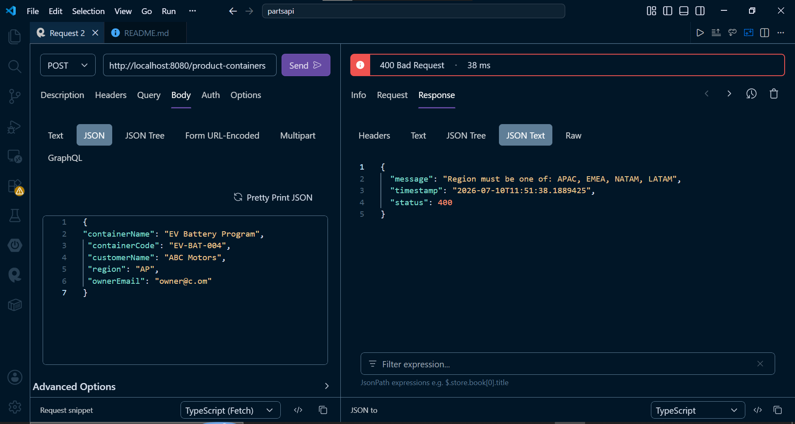
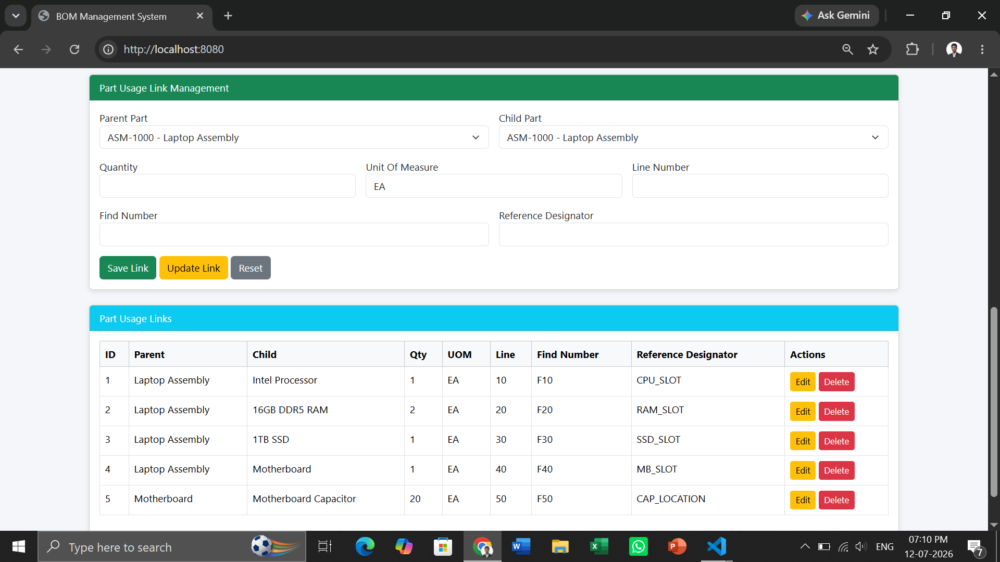
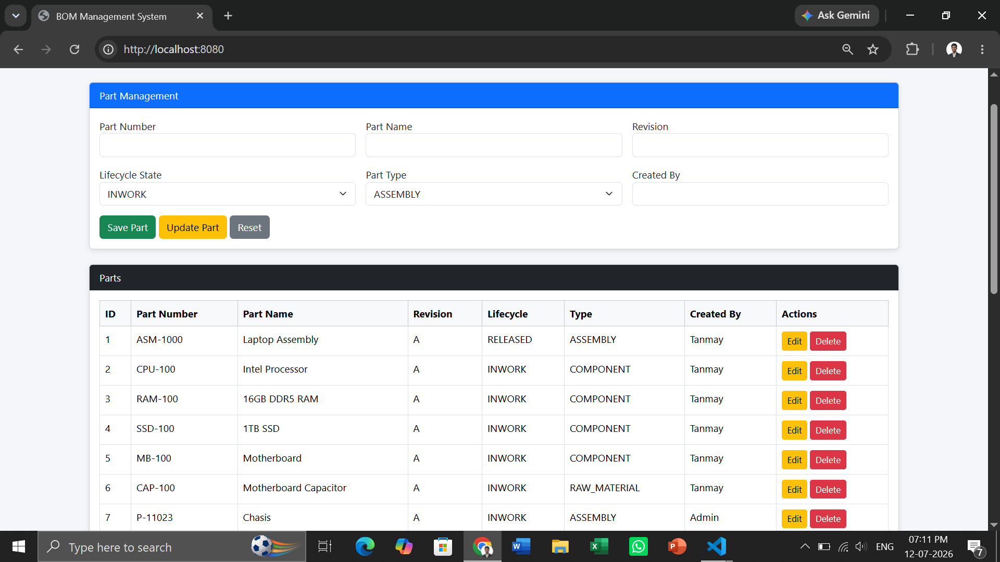

# Section 5: REST API and Spring Boot

## Question 14: Product Container Creation API

• Create a Spring Boot API to simulate Windchill Product Container creation.
• Validate mandatory fields, unique container code, allowed region, and owner email format.
POST /product-containers
{
"containerName": "EV Battery Program",
"containerCode": "EV-BAT-001",
"customerName": "ABC Motors",
"region": "APAC",
"ownerEmail": "owner@example.com"
}
Expected output / behavior:
{
"message": "Product container created successfully",
"containerCode": "EV-BAT-001",
"status": "CREATED"
}

## File Structure

```text
partsapi/
├── pom.xml
└── src/
    └── main/
        ├── java/
        │   └── com/example/partsapi/
        │       ├── PartsapiApplication.java
        │       ├── controller/
        │       │   └── ProductContainerController.java
        │       ├── exception/
        │       │   ├── GlobalExceptionHandler.java
        │       │   └── ResourceNotFoundException.java
        │       ├── model/
        │       │   └── ProductContainer.java
        │       ├── repository/
        │       │   └── ProductRContainerRepository.java
        │       └── service/
        │           └── ProductContainerService.java
        └── resources/
            └── application.properties

```

## Screenshots

**Container Created**


**Duplicate Container**


**Region Validation**


**Valid email format**






## Run Command

```bash
mvn spring-boot:run
```
