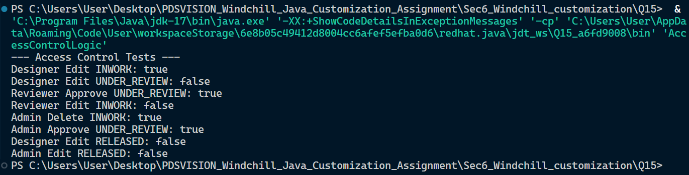

## Section 6: Windchill-Like Customization Scenarios

### Question 15: Access Control Logic Simulator

This module simulates a standard Product Lifecycle Management (PLM) access control checking mechanism, often found in systems like PTC Windchill. It evaluates whether a user has the appropriate permissions to execute a specific action on a part based on their role and the part's current lifecycle state.

#### **Core Logic & Business Rules**

The `canPerformAction` method enforces the following rules in a strict hierarchy:

1. **Global Restriction (Highest Priority):** Hardcoded safeguard ensuring that **no** user, regardless of their privileges (including Admins), can modify (`EDIT`) a part once it has reached the `RELEASED` state.
2. **Admin Privilege:** If the global restriction does not trigger, users with the `ADMIN` role bypass all other checks and are granted permission to execute any action.
3. **Role-Specific Scopes:**
   - **Designers** are strictly limited to `EDIT` actions, and only while the part is in the `INWORK` state.
   - **Reviewers** are strictly limited to `APPROVE` actions, and only while the part is in the `UNDER_REVIEW` state.
4. **Default Deny:** Any combination of inputs that does not explicitly match the above rules is automatically denied access (`false`), following the principle of least privilege.

## Screenshots

#### **Technical Notes**

- **Case Insensitivity:** The method normalizes all inputs to uppercase to prevent false negatives caused by inconsistent casing (e.g., "admin" vs "Admin").
- **Null Safety:** Pre-checks are implemented to handle `null` inputs gracefully, returning `false` rather than throwing a `NullPointerException`.
