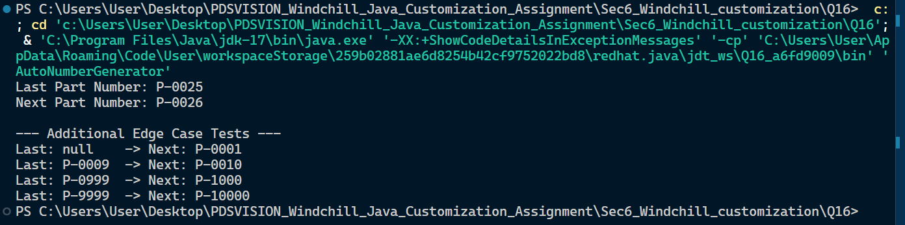

## Section 6: Windchill-Like Customization Scenarios

### Question 16: Auto Number Generator

This module simulates the automatic sequential numbering system commonly used in PLM and ERP systems (like PTC Windchill or SAP) to assign unique, standardized identifiers to newly created parts or documents.

## Screenshots



#### **Run Instructions**

To compile and execute the auto-number generator logic from your terminal:

1. **Compile the Java file:**
   ```bash
   javac AutoNumberGenerator.java
   ```
