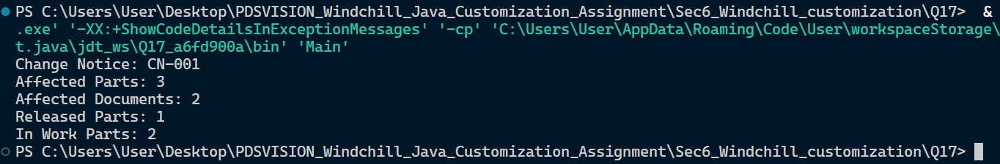

## Section

Object-Oriented Programming & Systems Design

## Question

Question 17: Change Notice Impact Analysis
• Create classes ChangeNotice, Part, and Document.
• A Change Notice can contain multiple affected parts and documents.
• Print an impact summary with affected object counts and state-wise part counts.
Expected output / behavior:
Change Notice: CN-001
Affected Parts: 3
Affected Documents: 2
Released Parts: 1
In Work Parts: 2

## File Structure

.
├── Main.java
└── README.md

## Screenshots



## Run Command

```bash
javac Main.java
java Main
```
