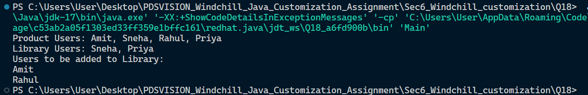

## Section

Collections Framework & Data Synchronization

## Question

Question 18: Team Role Synchronization
• Given Product container users and Library users, identify users who need to be added to the Library team.
• Use suitable collection operations.
Expected output / behavior:
Product Users: Amit, Sneha, Rahul, Priya
Library Users: Sneha, Priya
Users to be added to Library:
Amit

## File Structure

.
├── Main.java
└── README.md

## Screenshots



## Run Command

```bash
javac Main.java
java Main
```
