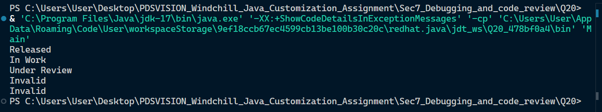

## Section

Section 7: Debugging and Code Review

## Question

Question 20: Improve the Code
• Review and improve the following code.
• Expected improvements: use .equals() or enum, add null handling, use meaningful names, avoid hardcoded strings where possible.

### Improvements Made

1. **Meaningful Names:** Changed the generic `process(String s)` to `processLifecycleState(String stateString)`.
2. **Null Handling:** Added a guard clause (`if (stateString == null)`) at the beginning of the method to safely catch null inputs before processing.
3. **Enum Implementation:** Introduced a `LifecycleState` enum. This replaces the repetitive `if-else` blocks and eliminates raw, hardcoded strings from the core logic.
4. **Encapsulation:** The display strings (e.g., "In Work") are safely encapsulated within the enum itself, making the code much easier to maintain and scale if new states are added later.

## Screenshots



## File Structure

.
├── Main.java
└── README.md

## Run Command

```bash
javac Main.java
java Main


```
