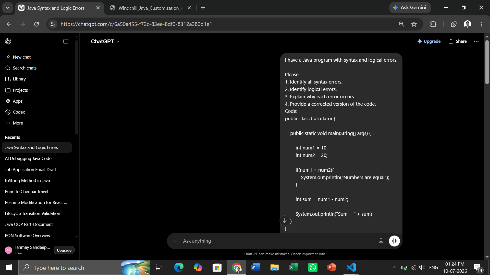
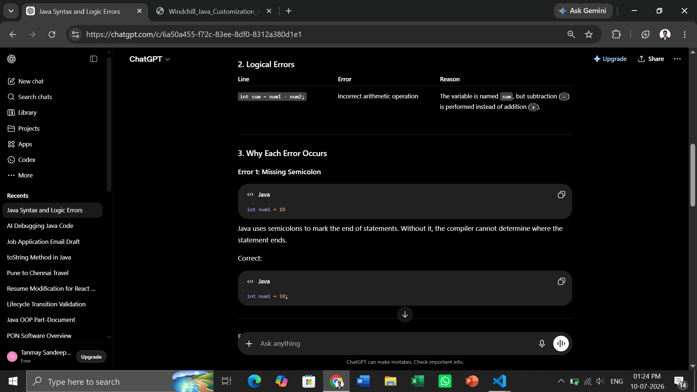
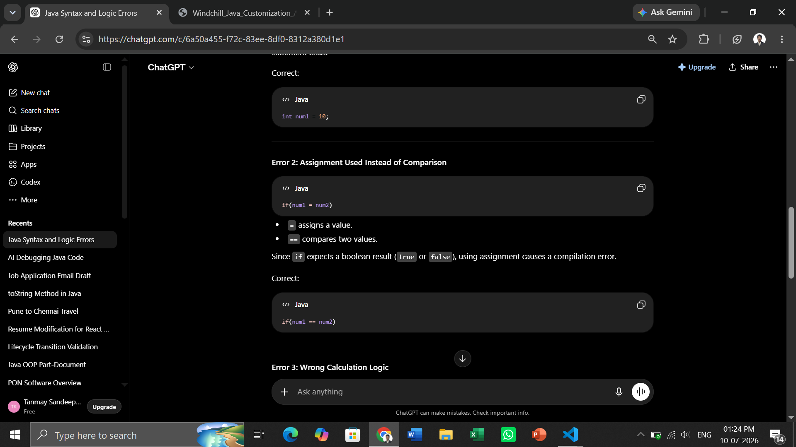
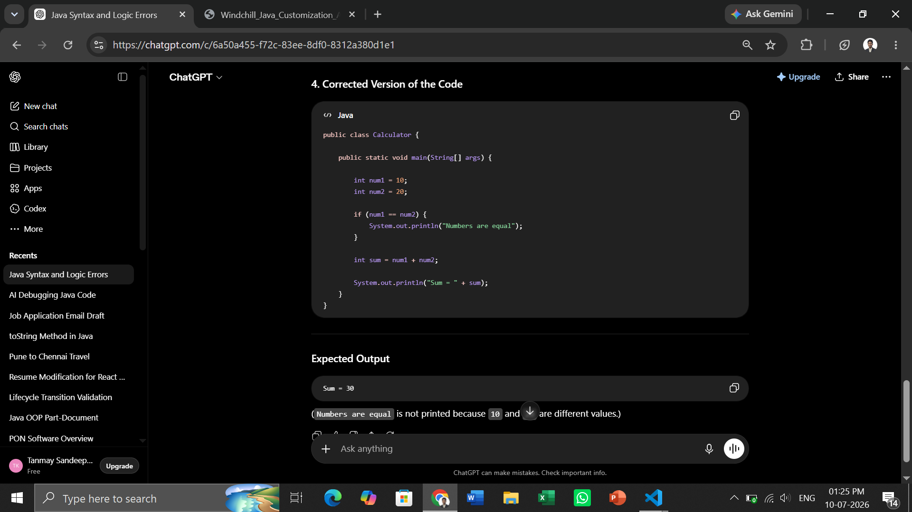

# AI-Assisted Coding and Debugging

# AI Tool Used

## **Tool:** ChatGPT (OpenAI)

# Original Buggy Code

```java
public class Calculator {

    public static void main(String[] args) {

        int num1 = 10
        int num2 = 20;

        if(num1 = num2){
            System.out.println("Numbers are equal");
        }

        int sum = num1 - num2;

        System.out.println("Sum = " + sum)
    }
}
```

---

# Errors Present in the Code

### Syntax Errors

1. Missing semicolon after:

```java
int num1 = 10
```

2. Missing semicolon after:

```java
System.out.println("Sum = " + sum)
```

3. Invalid condition:

```java
if(num1 = num2)
```

Assignment operator (`=`) used instead of comparison operator (`==`).

---

### Logical Error

The program calculates subtraction instead of addition:

```java
int sum = num1 - num2;
```

Expected:

```java
int sum = num1 + num2;
```

---

# AI Prompt Used

```text
I have a Java program with syntax and logical errors.

Please:
1. Identify all syntax errors.
2. Identify logical errors.
3. Explain why each error occurs.
4. Provide a corrected version of the code.
Code:
public class Calculator {

    public static void main(String[] args) {

        int num1 = 10
        int num2 = 20;

        if(num1 = num2){
            System.out.println("Numbers are equal");
        }

        int sum = num1 - num2;

        System.out.println("Sum = " + sum)
    }
}
```

---

# AI Response Summary

### 1. Syntax Errors

| Line                                 | Error                   | Reason                                                                                                       |
| ------------------------------------ | ----------------------- | ------------------------------------------------------------------------------------------------------------ |
| `int num1 = 10`                      | Missing semicolon (`;`) | Every Java statement must end with a semicolon.                                                              |
| `if(num1 = num2)`                    | Invalid condition       | `=` is the assignment operator, not a comparison operator. The `if` statement requires a boolean expression. |
| `System.out.println("Sum = " + sum)` | Missing semicolon (`;`) | Print statements are also Java statements and must end with a semicolon.                                     |

---

### 2. Logical Errors

| Line                     | Error                          | Reason                                                                                     |
| ------------------------ | ------------------------------ | ------------------------------------------------------------------------------------------ |
| `int sum = num1 - num2;` | Incorrect arithmetic operation | The variable is named `sum`, but subtraction (`-`) is performed instead of addition (`+`). |

---

### 3. Why Each Error Occurs

#### Error 1: Missing Semicolon

```java
int num1 = 10
```

Java uses semicolons to mark the end of statements. Without it, the compiler cannot determine where the statement ends.

Correct:

```java
int num1 = 10;
```

---

#### Error 2: Assignment Used Instead of Comparison

```java
if(num1 = num2)
```

- `=` assigns a value.
- `==` compares two values.

Since `if` expects a boolean result (`true` or `false`), using assignment causes a compilation error.

Correct:

```java
if(num1 == num2)
```

---

#### Error 3: Wrong Calculation Logic

```java
int sum = num1 - num2;
```

The variable name suggests addition, but subtraction is performed.

Correct:

```java
int sum = num1 + num2;
```

---

#### Error 4: Missing Semicolon After Print Statement

```java
System.out.println("Sum = " + sum)
```

The statement must end with a semicolon.

Correct:

```java
System.out.println("Sum = " + sum);
```

---

### 4. Corrected Version of the Code

```java
public class Calculator {

    public static void main(String[] args) {

        int num1 = 10;
        int num2 = 20;

        if (num1 == num2) {
            System.out.println("Numbers are equal");
        }

        int sum = num1 + num2;

        System.out.println("Sum = " + sum);
    }
}
```

---

### Expected Output

```text
Sum = 30
```

(`Numbers are equal` is not printed because `10` and `20` are different values.)

# Corrected Code

```java
public class Calculator {

    public static void main(String[] args) {

        int num1 = 10;
        int num2 = 20;

        if (num1 == num2) {
            System.out.println("Numbers are equal");
        } else {
            System.out.println("Numbers are not equal");
        }

        int sum = num1 + num2;

        System.out.println("Sum = " + sum);
    }
}
```

---

# Screenshots







# Manual Verification Performed

After applying the AI-generated fixes, the following checks were performed manually:

### Compilation Verification

- Program compiled successfully without errors.
- No syntax-related compilation issues remained.

### Logical Verification

Input Values:

```java
num1 = 10
num2 = 20
```

Expected Output:

```text
Numbers are not equal
Sum = 30
```

Actual Output:

```text
Numbers are not equal
Sum = 30
```

Output matched the expected result.

### Code Review Verification

Verified:

- Proper semicolon usage.
- Correct comparison operator (`==`).
- Correct arithmetic operation (`+`).
- Proper program flow with `if-else`.
