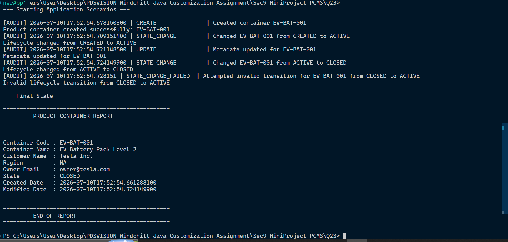

# Section 9: Mini Project - Product Container Management System

# Question 23: Product Container Management System

- **Build a small Java application** to manage Product Containers.
- **Core Functionalities:** Support creating product containers, updating metadata, changing lifecycle states, searching by code, and listing all containers.
- **System Validations:** Prevent duplicate codes, validate mandatory fields, and print an audit log for each operation.
- **Product Container Fields:** Container code, container name, customer name, region, owner email, lifecycle state, created date, and modified date.
- **Allowed Lifecycle States:** `CREATED`, `ACTIVE`, `ON_HOLD`, `CLOSED`.
- **Allowed Transitions:** \* `CREATED` -> `ACTIVE`
  - `ACTIVE` -> `ON_HOLD`
  - `ON_HOLD` -> `ACTIVE`
  - `ACTIVE` -> `CLOSED`

Expected output / behavior:
Product container created successfully: EV-BAT-001
Lifecycle changed from CREATED to ACTIVE
Metadata updated for EV-BAT-001
Invalid lifecycle transition from CLOSED to ACTIVE

# Product Container Management System

A lightweight, core Java application designed to manage the lifecycle and metadata of Product Containers. This system enforces strict state-machine rules for lifecycle transitions, validates mandatory fields, prevents duplicate entries, and maintains an automated audit log for all operations.

# Screenshots



## How to Run

Since this is a self-contained, single-file application, you do not need Maven, Gradle, or Spring Boot to test the core logic.

1. **Save the file:** Save the provided Java code as `ProductContainerApp.java` in your working directory.
2. **Compile the code:** Open your terminal or command prompt, navigate to the directory containing the file, and run:

   ```bash
   javac ProductContainerApp.java
   java ProductContainerApp.java
   ```
